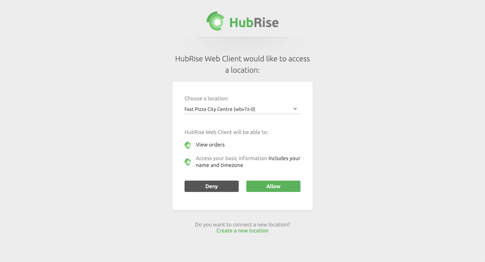
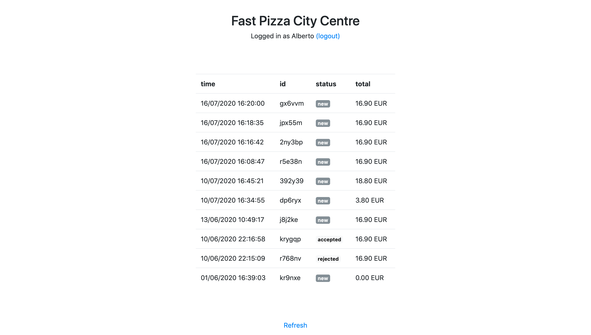
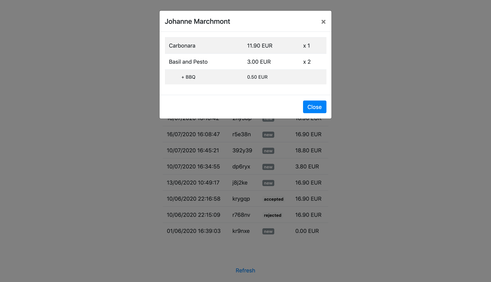

<a href="https://www.hubrise.com/"></a>
<br><br><br>

# HubRise {{app_name}} Template

{{app_name}} is an app that prints new orders received by your HubRise location, with just a few lines of code.

You can fork this repository and make changes to the code to create your own app. 


## Try the app

First, you need to [create a HubRise account](https://manager.hubrise.com/signup). It's free and it only takes a minute. 

Then, simply [open the app](http://philatist-fish-74534.netlify.com) in your browser. 

You will be asked to connect the app to your HubRise account. 
Granting permissions is a necessary step in every OAuth2.0 authentication process, and requires the user to manually **Allow** the app access. 



You will then see a single-page app that displays the list of the latest orders received by your HubRise location. 
Each line in the logs displays the time, id, status, and total price of the order.



Clicking on one of the logs reveals additional information about the order, such as the customer's details and the purchased products. 




## What this app is NOT

This app is not production ready! 
Consider it some boilerplate code that you can buil upon to create your own app.
It is also useful to show some of the things you should _not_ do in your app! 

For example, in the first line of the `js/app.js` file, you will find the client secret. 
This is bad coding practice. 

Also, the user interface is too crude to be used in a real case scenario. 

## Prerequisites

...

## Running {{app_name}} locally

To run {{app_name}} locally, follow these steps:

Linux and macOS:
```
<run_command>
```

Windows:
```
<run_command>
```

## Additional resources

The HubRise documentation provides you additional information to get you started and make this app production ready. 

To learn more about the HubRise platform, see our [User guide](https://www.hubrise.com/docs/).

To learn how to connect your solution to HubRise, try our [Quick start guide](https://www.hubrise.com/developers/quick-start).

For more information about the HubRise API, see our [API reference](https://www.hubrise.com/developers/api/general-concepts).

## Contact

If you need help or want to integrate your solution with HubRise, contact us at <support@hubrise.com>.

## License

This app and the relative code are released under the [<license_name>](<link>). 